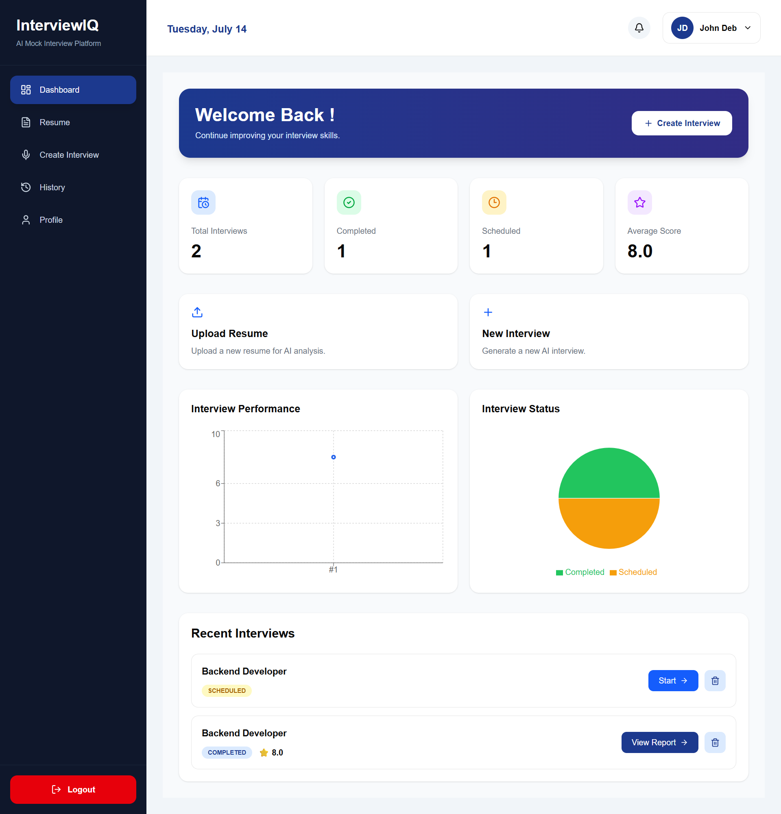
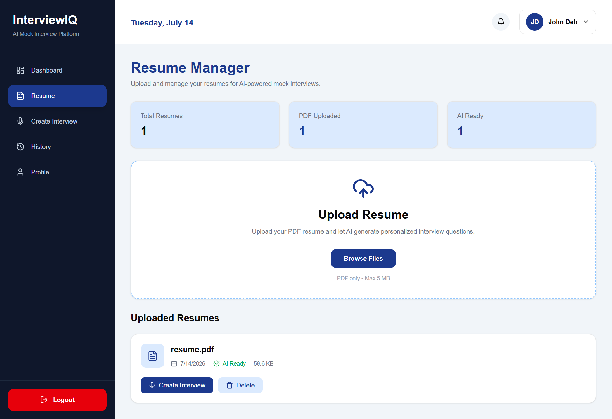
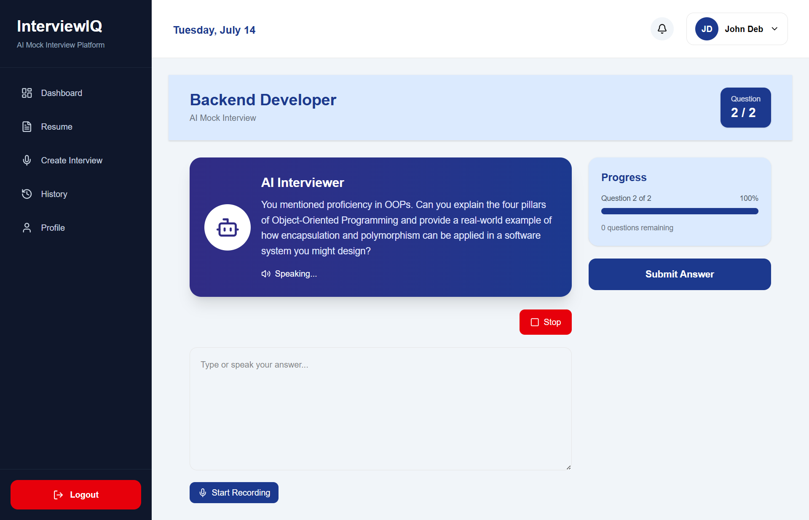
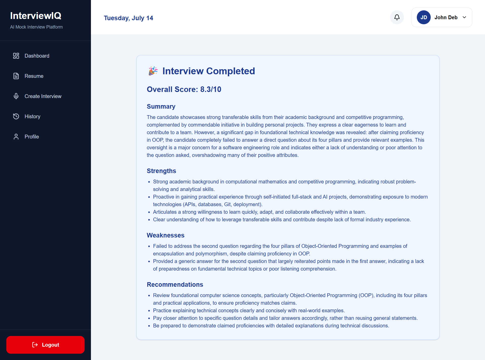
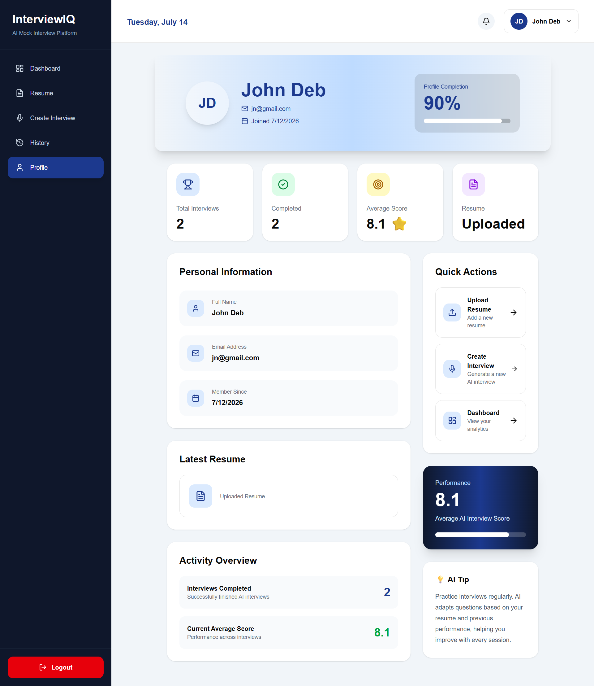
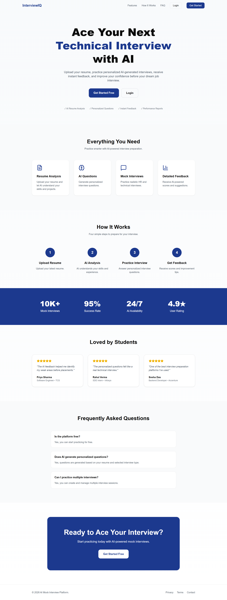
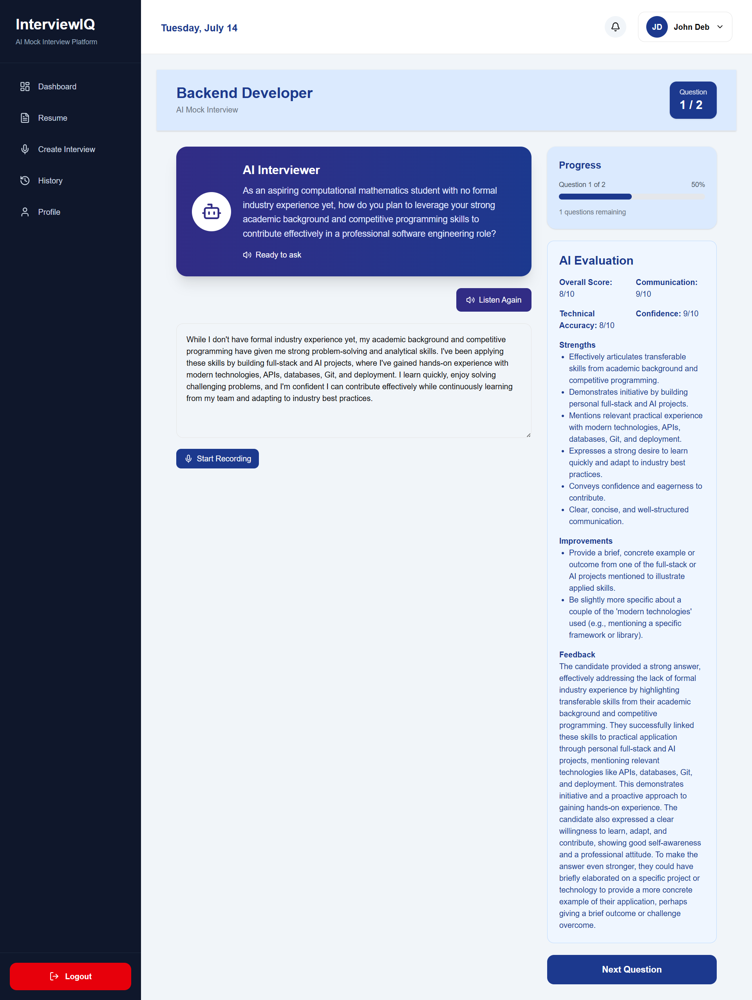
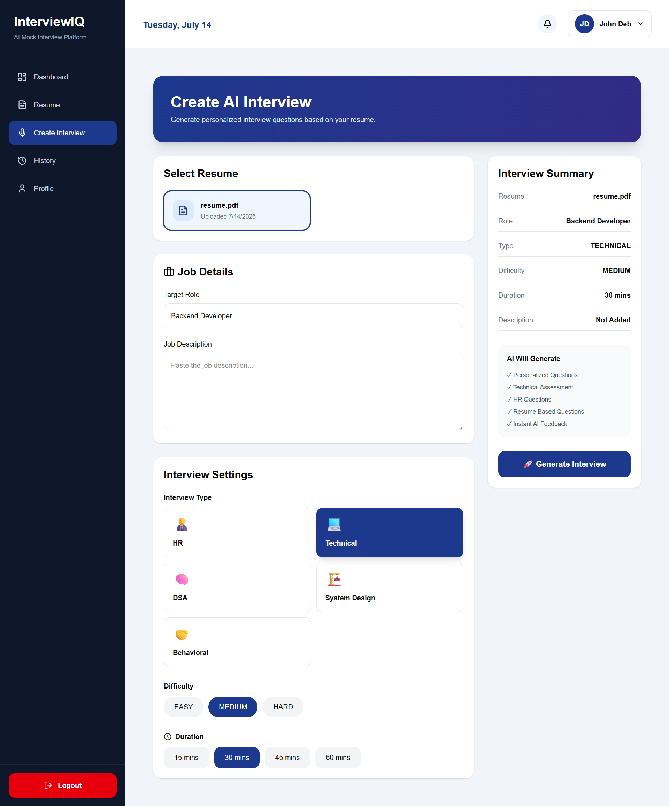
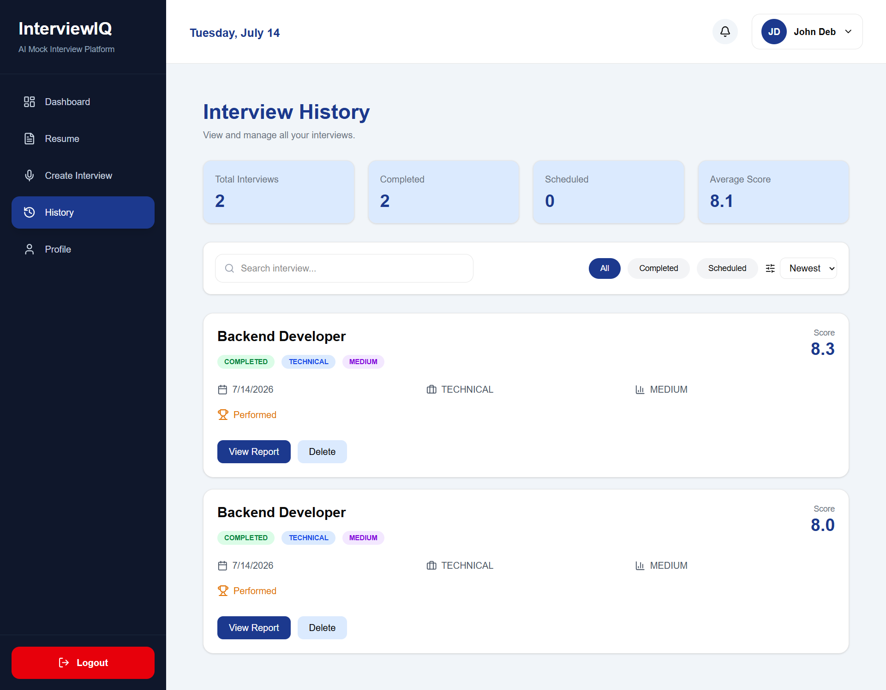

# 🎯 InterviewIQ

> **An AI-Powered Mock Interview Platform that helps candidates prepare for technical interviews using Generative AI, resume analysis, voice interaction, and personalized feedback.**

<p align="center">


</p>

---

## 🌐 Live Demo

**Frontend**

https://interview-iq-web-mauve.vercel.app

**Backend API**

https://interviewiq-hzjd.onrender.com

**GitHub Repository**

https://github.com/trishna-bhowmik/InterviewIQ

---

## 📖 About

InterviewIQ is a full-stack AI-powered mock interview platform designed to simulate real interview experiences.

Users can upload their resumes, generate personalized interview questions using Google's Gemini AI, answer using either voice or text, and receive AI-generated feedback to improve their interview performance.

The application follows a modern SaaS architecture with secure authentication, cloud storage, scalable APIs, and production deployment.

---
# ✨ Features

## 🤖 AI-Powered Interview Experience

- 📄 AI-powered resume analysis using **Google Gemini**
- 🎯 Generates personalized interview questions based on your resume
- 🧠 Supports Technical, HR, and Behavioral interview preparation
- 📊 AI-generated interview feedback with improvement suggestions

---

## 🎙️ Voice Interview

- 🎤 Speech-to-Text answer recording
- 🔊 AI Text-to-Speech reads interview questions aloud
- 💬 Natural voice-based interview experience
- ⏱️ Real-time interview timer

---

## 📑 Resume Management

- Upload PDF and DOCX resumes
- Secure cloud storage with Cloudinary
- Automatic resume text extraction
- Manage multiple resumes from one dashboard

---

## 🔐 Authentication & Security

- Secure JWT Authentication
- Refresh Token implementation
- Protected API routes
- Password hashing using bcrypt
- HTTP-only cookies
- Secure middleware using Helmet

---

## 📈 Dashboard

- Personal interview dashboard
- Resume statistics
- Interview history
- Performance tracking
- User profile management

---

## ☁️ Cloud Integration

- PostgreSQL database hosted on Neon
- Resume storage with Cloudinary
- Backend deployed on Render
- Frontend deployed on Vercel

---

## 🚀 Modern Full Stack Architecture

- Next.js App Router
- Express.js REST API
- Prisma ORM
- PostgreSQL
- TypeScript across frontend and backend
- React Query for server state management
- Responsive UI built with Tailwind CSS and shadcn/ui

---

# 🚀 Key Highlights

- ✅ Production-ready full-stack architecture
- ✅ Cloud-native deployment
- ✅ AI-powered interview generation
- ✅ Resume-based personalization
- ✅ Voice-enabled interviews
- ✅ Secure authentication with refresh tokens
- ✅ Cloud resume storage
- ✅ Mobile responsive interface

# 📸 Application Preview

> **InterviewIQ** provides a modern, responsive, and intuitive user interface designed to simulate real interview experiences.

| Dashboard | Resume Manager |
|------------|----------------|
|  |  |

| Interview Session | AI Feedback |
|-------------------|-------------|
|  |  |

| User Profile | Landing Page |
|--------------|--------------|
|  |  |

| Answer Evalution | Create Interview |
|--------------|--------------|
|  |  |

| History |
|--------------|
|  |


---

## 🎥 Demo

> Live Demo

🌐 https://interview-iq-web-mauve.vercel.app

---

> GitHub Repository

💻 https://github.com/trishna-bhowmik/InterviewIQ

# 🏗️ System Architecture

```text
                        Browser
                           │
                           ▼
               Next.js Frontend (Vercel)
                           │
                     HTTPS REST API
                           │
                           ▼
                Express Backend (Render)
             ┌─────────────┼──────────────┐
             │             │              │
             ▼             ▼              ▼
      Google Gemini     Neon DB      Cloudinary
        (AI Engine)   PostgreSQL    Resume Storage
             │
             ▼
      AI Interview Generation
      Resume Analysis
      AI Feedback
```

---

## Request Flow

```text
User

↓

Next.js Frontend

↓

Express REST API

↓

Authentication Middleware

↓

Business Logic

↓

Prisma ORM

↓

PostgreSQL (Neon)

↓

Response to Frontend
```

---

## AI Workflow

```text
Resume Upload

↓

Cloudinary

↓

Resume Text Extraction

↓

Gemini AI

↓

Interview Questions

↓

Voice/Text Answers

↓

Gemini Feedback

↓

Dashboard
```
# 🛠️ Tech Stack

InterviewIQ is built using a modern, production-ready technology stack that emphasizes scalability, maintainability, and performance.

---

## Frontend

| Technology | Purpose |
|------------|---------|
| **Next.js 15/16** | React Framework with App Router |
| **React 19** | Component-based UI |
| **TypeScript** | Type-safe development |
| **Tailwind CSS** | Utility-first CSS framework |
| **shadcn/ui** | Modern UI components |
| **React Query (TanStack Query)** | Server state management |
| **Axios** | API communication |
| **Lucide React** | Icon library |
| **Sonner** | Toast notifications |

---

## Backend

| Technology | Purpose |
|------------|---------|
| **Node.js** | JavaScript runtime |
| **Express.js** | REST API framework |
| **TypeScript** | Backend type safety |
| **Prisma ORM** | Database ORM |
| **JWT** | Authentication |
| **bcrypt** | Password hashing |
| **Multer** | File upload handling |
| **Cookie Parser** | Cookie management |
| **Helmet** | Security headers |
| **CORS** | Cross-Origin Resource Sharing |
| **Pino** | High-performance logging |

---

## Artificial Intelligence

| Technology | Purpose |
|------------|---------|
| **Google Gemini API** | Resume analysis |
| **Google Gemini API** | Interview question generation |
| **Google Gemini API** | AI interview feedback |

---

## Database & Storage

| Technology | Purpose |
|------------|---------|
| **PostgreSQL** | Primary database |
| **Neon** | Managed PostgreSQL hosting |
| **Cloudinary** | Resume file storage |

---

## Deployment

| Service | Purpose |
|----------|---------|
| **Vercel** | Frontend hosting |
| **Render** | Backend hosting |
| **GitHub** | Version control |

---

## Voice Features

| Technology | Purpose |
|------------|---------|
| **Web Speech API** | Speech-to-Text |
| **Speech Synthesis API** | Text-to-Speech |

---

# ⚙️ Development Tools

- VS Code
- Git
- GitHub
- pnpm
- TurboRepo
- Prisma Studio
- Postman
- Docker

  # 📂 Project Structure

```text
InterviewIQ/
│
├── apps/
│   ├── gateway/                 # Express Backend
│   │   ├── prisma/
│   │   ├── src/
│   │   │   ├── common/
│   │   │   ├── config/
│   │   │   ├── modules/
│   │   │   ├── routes/
│   │   │   └── server.ts
│   │   └── package.json
│   │
│   ├── web/                     # Next.js Frontend
│   │   ├── app/
│   │   ├── src/
│   │   ├── components/
│   │   ├── hooks/
│   │   ├── lib/
│   │   └── package.json
│   │
│   └── docs/
│
├── packages/
│
├── infrastructure/
│
├── assets/
│
├── README.md
│
└── pnpm-workspace.yaml
```

# ⚙️ Installation & Local Setup

Follow these steps to run InterviewIQ locally.

---

## Prerequisites

Before getting started, ensure the following software is installed:

- Node.js (v22 or later recommended)
- pnpm
- Git
- Docker Desktop (for local PostgreSQL, optional)
- A Google Gemini API Key
- A Cloudinary Account
- A Neon PostgreSQL Database (recommended)

---

## Clone the Repository

```bash
git clone https://github.com/trishna-bhowmik/InterviewIQ.git

cd InterviewIQ
```

---

## Install Dependencies

```bash
pnpm install
```

---

## Configure Environment Variables

Create a `.env` file inside:

```text
apps/gateway/
```

and add the required environment variables.

Example:

```env
PORT=4000
NODE_ENV=development

APP_NAME=InterviewIQ
APP_VERSION=1.0.0

DATABASE_URL=your_database_url

JWT_ACCESS_SECRET=your_access_secret
JWT_REFRESH_SECRET=your_refresh_secret

GEMINI_API_KEY=your_gemini_api_key

CLOUDINARY_CLOUD_NAME=your_cloud_name
CLOUDINARY_API_KEY=your_api_key
CLOUDINARY_API_SECRET=your_api_secret
```

---

## Generate Prisma Client

```bash
cd apps/gateway

pnpm prisma generate
```

---

## Push Database Schema

```bash
pnpm prisma db push
```

---

## Start the Backend

```bash
pnpm dev
```

The backend will be available at:

```text
http://localhost:4000
```

---

## Start the Frontend

Open another terminal.

```bash
cd apps/web

pnpm dev
```

The frontend will be available at:

```text
http://localhost:3000
```

---

## Production Deployment

### Frontend

- Vercel

### Backend

- Render

### Database

- Neon PostgreSQL

### Resume Storage

- Cloudinary

---

## Verify the Application

After starting both services:

- Register a new account
- Login
- Upload a resume
- Generate an AI interview
- Answer questions using text or voice
- Receive AI-generated feedback

  # 🔐 Environment Variables

| Variable | Description |
|----------|-------------|
| `DATABASE_URL` | PostgreSQL Database Connection String |
| `PORT` | Backend Server Port |
| `NODE_ENV` | Application Environment |
| `APP_NAME` | Application Name |
| `APP_VERSION` | Current Version |
| `JWT_ACCESS_SECRET` | Secret Key for Access Tokens |
| `JWT_REFRESH_SECRET` | Secret Key for Refresh Tokens |
| `GEMINI_API_KEY` | Google Gemini API Key |
| `CLOUDINARY_CLOUD_NAME` | Cloudinary Cloud Name |
| `CLOUDINARY_API_KEY` | Cloudinary API Key |
| `CLOUDINARY_API_SECRET` | Cloudinary API Secret |
| `FRONTEND_URL` | Frontend URL for CORS (Production) |

> **Note:** Never commit your `.env` file to GitHub. Use environment variables provided by your hosting platform (Render, Vercel, etc.).

# 🚀 Deployment

InterviewIQ is deployed using modern cloud services to ensure scalability, reliability, and accessibility.

---

## Frontend

- **Platform:** Vercel
- **Live URL:** https://interview-iq-web-mauve.vercel.app

---

## Backend

- **Platform:** Render
- **API URL:** https://interviewiq-hzjd.onrender.com

---

## Database

- **Platform:** Neon PostgreSQL

---

## File Storage

- **Platform:** Cloudinary

---

## Deployment Architecture

```text
                    Vercel
             (Next.js Frontend)
                     │
                     ▼
              HTTPS REST API
                     │
                     ▼
           Render Express Backend
              │       │       │
              ▼       ▼       ▼
         Neon DB   Gemini   Cloudinary
```

---

## Deployment Checklist

- ✅ Frontend deployed on Vercel
- ✅ Backend deployed on Render
- ✅ PostgreSQL hosted on Neon
- ✅ Cloudinary integration
- ✅ Environment variables configured
- ✅ HTTPS enabled
- ✅ Production-ready architecture

  # 📡 API Overview

InterviewIQ exposes a RESTful API for authentication, resume management, interview generation, AI feedback, and dashboard analytics.

---

## Authentication

| Method | Endpoint | Description |
|--------|----------|-------------|
| POST | `/api/v1/auth/register` | Register a new user |
| POST | `/api/v1/auth/login` | User login |
| POST | `/api/v1/auth/refresh` | Refresh access token |
| GET | `/api/v1/auth/me` | Get current user |

---

## Resume

| Method | Endpoint |
|--------|----------|
| POST | `/api/v1/resume` |
| GET | `/api/v1/resume` |
| DELETE | `/api/v1/resume/:id` |

---

## AI

| Method | Endpoint |
|--------|----------|
| POST | `/api/v1/ai/analyze-resume` |
| POST | `/api/v1/ai/generate-interview` |
| POST | `/api/v1/ai/feedback` |

---

## Interviews

| Method | Endpoint |
|--------|----------|
| GET | `/api/v1/interviews` |
| GET | `/api/v1/interviews/:id` |
| POST | `/api/v1/interviews` |

---

## Answers

| Method | Endpoint |
|--------|----------|
| POST | `/api/v1/answers` |

---

## Dashboard

| Method | Endpoint |
|--------|----------|
| GET | `/api/v1/dashboard` |

---

## Profile

| Method | Endpoint |
|--------|----------|
| GET | `/api/v1/profile` |
| PATCH | `/api/v1/profile` |

# 🗺️ Future Roadmap

InterviewIQ will continue to evolve with additional AI capabilities and interview preparation tools.

## Planned Features

- [ ] Coding Interview Environment (Monaco Editor)
- [ ] Company-Specific Interview Modes
- [ ] AI Interview Report (PDF)
- [ ] Dark Mode
- [ ] Email Interview Reports
- [ ] Leaderboards
- [ ] Interview Sharing
- [ ] Multi-language Interviews
- [ ] AI Performance Analytics
- [ ] Recruiter Dashboard

---

## Long-Term Vision

Build InterviewIQ into a comprehensive AI-powered interview preparation platform supporting technical, behavioral, coding, and domain-specific interviews for students and professionals.

# 🤝 Contributing

Contributions, issues, and feature requests are welcome.

If you'd like to improve InterviewIQ:

1. Fork the repository.
2. Create a new feature branch.
3. Commit your changes.
4. Push your branch.
5. Open a Pull Request.

Please ensure your code follows the project's coding standards and includes appropriate documentation where necessary.

# 📄 License

This project is licensed under the MIT License.

See the `LICENSE` file for more information.

# 👩‍💻 Author

**Trishna Bhowmik**

B.Tech in Computational Mathematics | Full Stack & AI Developer

- 🌐 Live Demo: https://interview-iq-web-mauve.vercel.app
- 💻 GitHub: https://github.com/trishna-bhowmik/InterviewIQ

---

If you found this project useful, consider giving it a ⭐ on GitHub.
